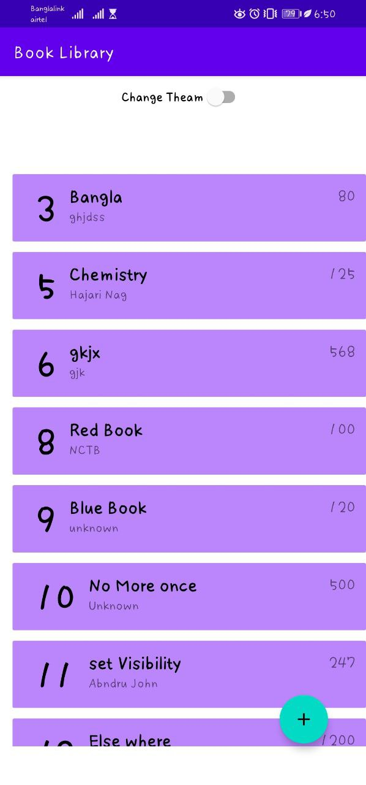
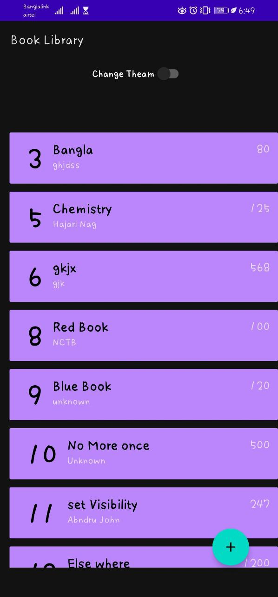
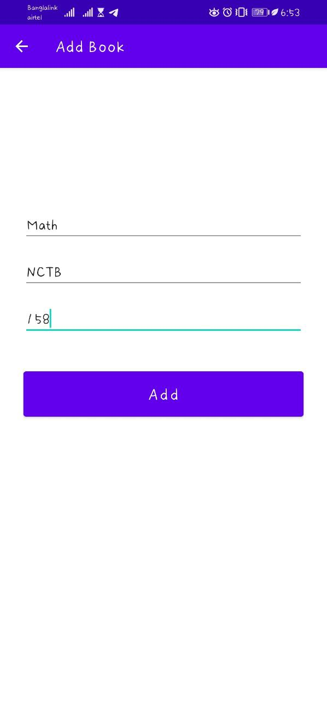
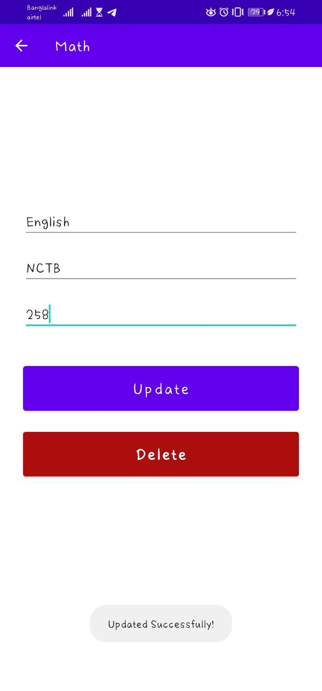
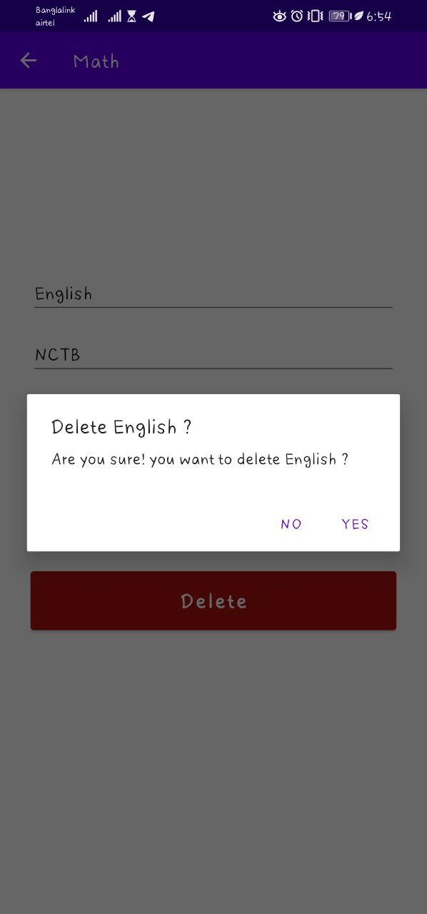

 <h1>BookLibrary_App</h1>
<h3>A simple Book library App for a small organization.</h3>

<b>Features used for this Project:</b>
1. Four (4) diffrent Screens.
2. An adapter view (Recycler view)
3. App Drawer
4. Two Mode
5. Shared Preference(Contain night mode/ normal mode)
6. SQLight Database.

<h3>Normal Mode of the Book Library</h3>
 

<h3>Dark Mode of the Book Library</h3>
 

<h3>Adding Book in the Book Library</h3>
 

<h3>Update Book details in the Book Library</h3>
 

<h3>Delete Book from the Book Library</h3>
 

<h3>App Drawer of the Book Library but slighly working</h3>
 

